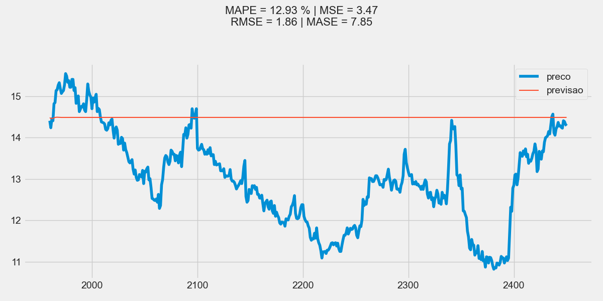
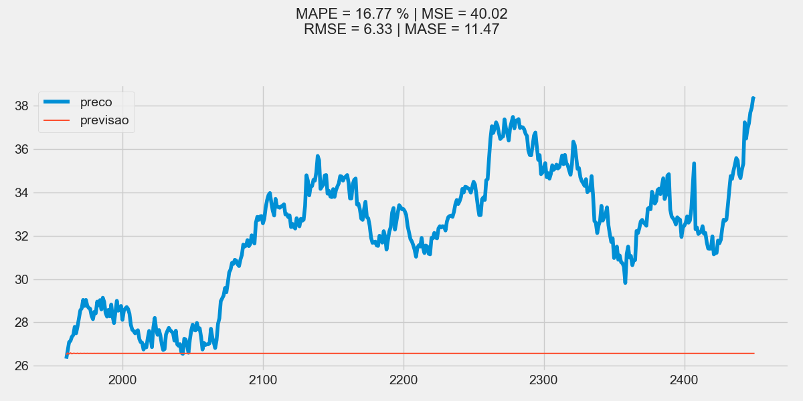
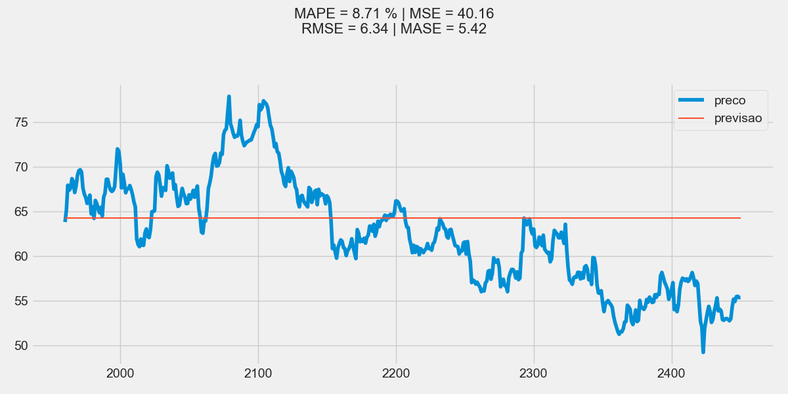
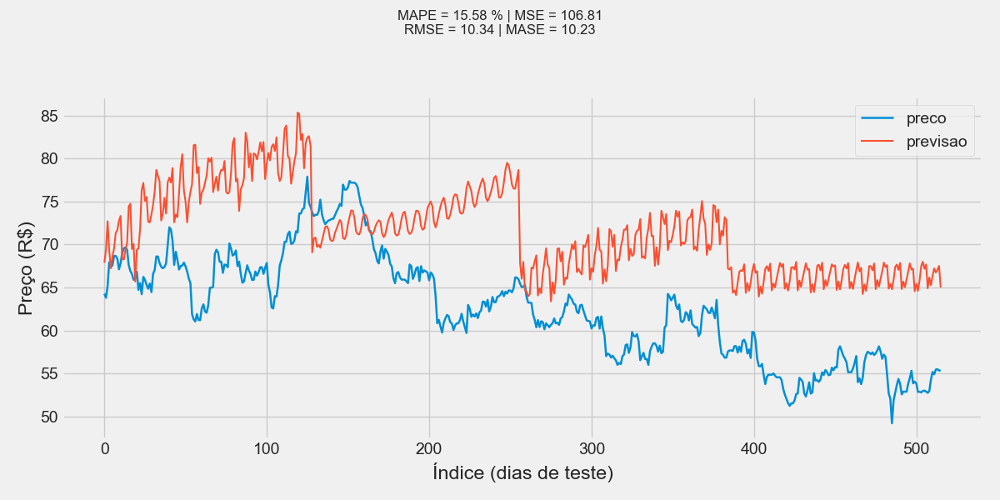
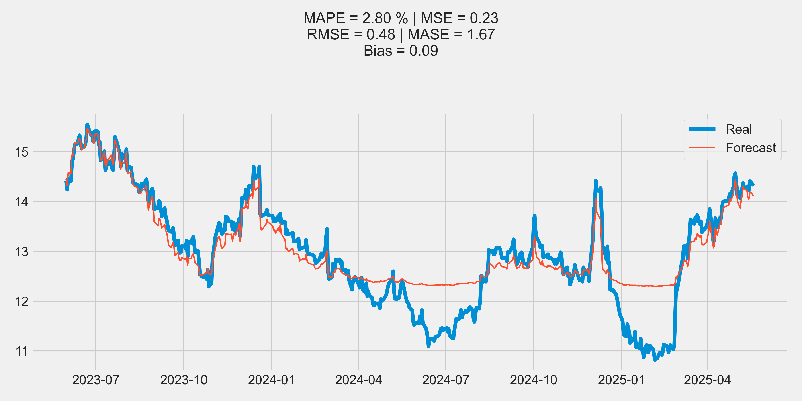
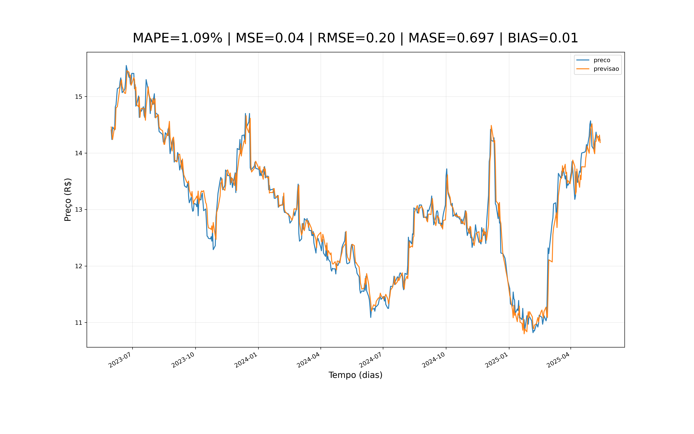
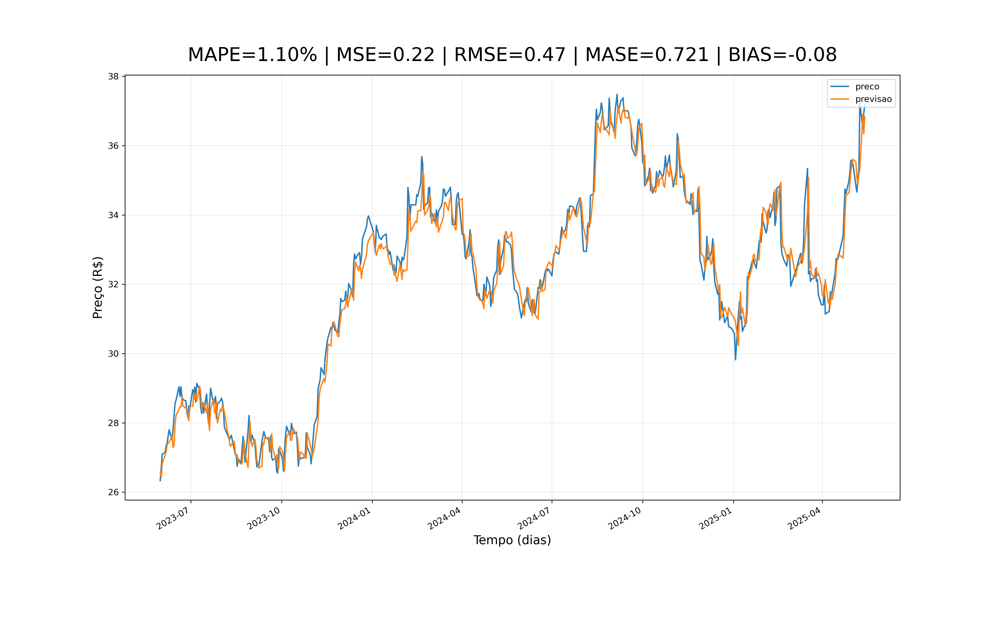
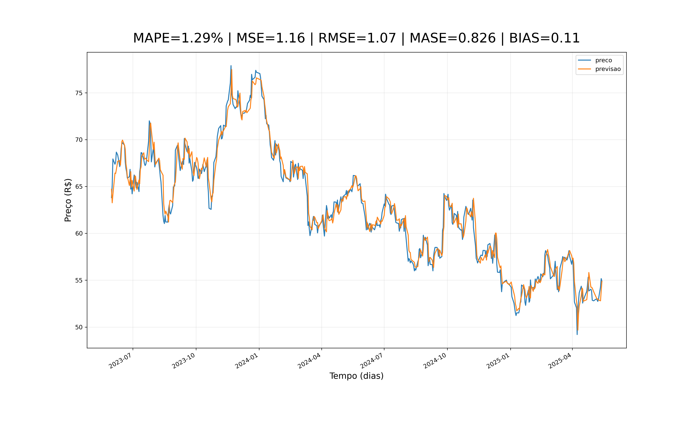

# 📊 Análise Comparativa entre Modelos Transformers e Técnicas Tradicionais na Previsão de Séries Temporais Financeiras

Este repositório contém todo o código, datasets processados, experimentos e ambientes Conda utilizados no Trabalho de Conclusão de Curso **“Análise comparativa entre modelos Transformers e técnicas tradicionais na previsão de séries temporais financeiras”**, desenvolvido em 2025.

---

## 🧠 Sobre o TCC

A previsão de preços financeiros é um dos desafios clássicos em séries temporais:  
as séries são **não estacionárias**, possuem **alta volatilidade**, **ruído intenso** e sofrem influência de eventos externos e comportamento humano.

Historicamente, modelos tradicionais como **ARIMA** e redes neurais como **LSTM** foram usados com frequência.  
No entanto, avanços recentes introduziram modelos baseados em **Transformers**, como:

- **PatchTST**, orientado a patches temporais e multi-step forecasting  
- **TimesFM (Google)**, um modelo de foundation baseado em forecasting de amplo contexto  

O objetivo deste TCC foi:

### 🎯 Objetivo Geral
Comparar, em profundidade, o desempenho entre:
- **Modelos tradicionais**: ARIMA, LSTM  
- **Modelos modernos baseados em Transformers**: PatchTST e TimesFM  

utilizando dados reais da B3 (VALE3, ABEV3, ITUB4), com e sem variáveis fundamentalistas.

### 🔍 Questões centrais avaliadas
- Como modelos univariados e multivariados lidam com séries financeiras não estacionárias?  
- Há ganho real ao incluir indicadores fundamentalistas?  
- Transformers realmente superam métodos clássicos no contexto brasileiro?  
- Qual modelo entrega o menor erro preditivo em **one-step ahead forecasting**?  

### 📈 Resumo dos achados
- Modelos tradicionais **não capturam bem** rupturas de nível, volatilidade e oscilações rápidas.  
- LSTM supera ARIMA, mas mostra sensibilidade à normalização e janelas temporais.  
- **PatchTST e TimesFM apresentaram desempenho superior**, especialmente em estabilidade, generalização e robustez a ruído.  
- O uso de dados fundamentalistas **não trouxe ganho de performance**, devido à discrepância de granularidade (diária × trimestral).  

O repositório contém todo o pipeline usado para comprovar esses achados.

---

# 🧪 Ambientes Conda do Projeto

Para garantir **reprodutibilidade total**, cada modelo roda em um ambiente Conda independente, evitando conflitos entre PyTorch, TensorFlow, Statsmodels e bibliotecas específicas.

Todos os ambientes estão na pasta:

| Ambiente | Arquivo YAML | Usado para |
|---------|--------------|------------|
| `arima-env` | `envs/arima.yml` | ARIMA, SARIMA, TSA |
| `lstm-tf-env` | `envs/lstm-tf.yml` | Redes LSTM em TensorFlow |
| `timesfm-env` | `envs/timesfm.yml` | Modelo TimesFM (Google) |
| `patchtst-env` | `envs/patchtst.yml` | PatchTST (PyTorch) |
| `fundamentalista-env` | `envs/fundamentalista.yml` | Geração e fusão de dados fundamentalistas |

---

# 📦 Ambientes Conda – Como Instalar e Executar Cada Modelo

Cada modelo deste repositório possui seu próprio arquivo `environment.yml` dentro da pasta correspondente.  
Para garantir reprodutibilidade, **crie e ative o ambiente diretamente na pasta do modelo**.

---

# ARIMA

### Criar ambiente
```bash
cd modelos/arima
conda env create -f environment.yml
```

### Ativar ambiente
```bash
conda activate arima
```

### Executar
```bash
python arima.py
```

---

# TimesFM (Google)

### Criar ambiente
```bash
cd modelos/google
conda env create -f environment.yml
```

### Ativar ambiente
```bash
conda activate timesfm
```

### Executar
```bash
python timesfm.py
```

---

# LSTM (TensorFlow)

### Criar ambiente
```bash
cd modelos/lstm
conda env create -f environment.yml
```

### Ativar ambiente
```bash
conda activate lstm-tf27
```

### Executar
```bash
python lstm.py
```

### Executar versão com fundamentalistas
```bash
python lstmfundamentalista.py
```

---

# PatchTST (PyTorch)

### Criar ambiente
```bash
cd modelos/PatchTST
conda env create -f environment.yml
```

### Ativar ambiente
```bash
conda activate patchtst
```

### Executar
```bash
python patchTST.py
```

### Executar versão com fundamentalistas
```bash
python patchComFundamentalista.py
```
# 📊 Resultados

## 🔹 ARIMA

### ABEV3


### ITUB4


### VALE3


---

## 🔹 TimesFM (Google)

### ABEV3


### ITUB4


### VALE3


---

## 🔹 LSTM

### ABEV3


### ITUB4


### VALE3


---

## 🔹 PatchTST

### ABEV3


### ITUB4


### VALE3

